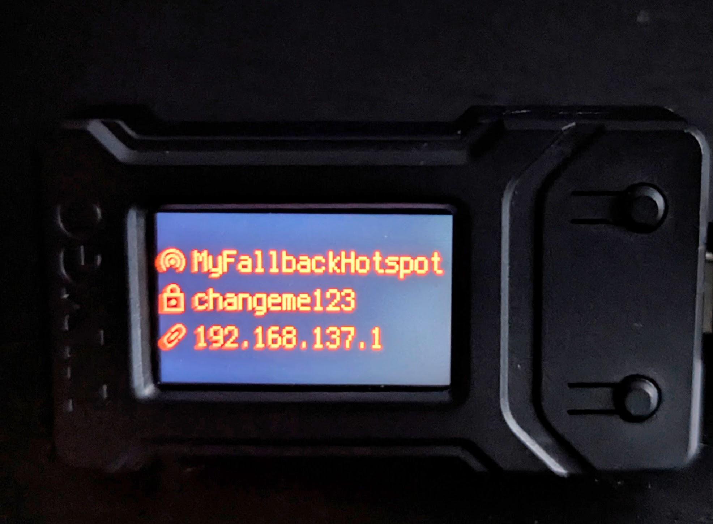

# Autospot USB companion

Autospot companion is a DIY USB dongle based on a microcontroller with a display and a USB port.

Autospot companion plugs into the computer running [autospot](https://github.com/uaraven/autospot) and shows the current connection status, machine IP address and hotspot name/password if hotspot is available. Note that the companion **requires** running autospot; it doesn't work by itself.

This repository contains the source code for the Autospot companion. This code runs on a CircuitPython-compatible microcontroller, connected to the host computer by USB and displaying the network connection information.

## Requirements

A microcontroller that is compatible with CircuitPython 10, has a display, and presents itself as a USB mass-storage device. Examples include LilyGo T-Display RP2040, LilyGo T-Dongle S3, etc.

### Why USB mass-storage?

The companion code is as simple as it gets - it reads the file from the storage and displays its contents. Autospot does not support Serial-over-USB communications, it only writes JSON to the specified drive.

CircuitPython automatically presents the microcontroller's flash memory as a USB drive for the _compatible_ devices. Usually, "compatible" means a device that can manage USB connection on its own. A lot of popular ESP-based microcontrollers are not supported, as they require a separate chip for USB connection.

See [below](#supported-boards) for the list of tested boards.

## Installation

Install [CircuitPython](https://circuitpython.org/downloads) version 10 onto your microcontroller and then copy `code.py` and `boot.py` files to the CIRCUITPY drive.
In the `board` directory select the folder corresponding to your microcontroller and copy all files and folders to the CIRCUITPY drive as well. There usually will be `hal.py` and `lib` folders, but there might be other files and folders, copy everything.
**Note**: All the files must be copied to the root of the CIRCUITPY drive. After copying, unmount the disk, disconnect it and then reconnect it back again.

Run autospot - the status of the connection should be displayed on the controller's display.

If autospot's logs shows "no companion device found", you might need to change the configuration of the USB device, refer to [companion installation guide](install.txt) for more details.

## Supported boards

|                                   Board                                   | CircuitPython download                                   | Notes                                        |
| :-----------------------------------------------------------------------: | :------------------------------------------------------- | :------------------------------------------- |
| [LilyGo T-Display RP2040](https://lilygo.cc/collections/t-display-series) | https://circuitpython.org/board/lilygo_t_display_rp2040/ | It looks like LilyGo discontinued this board |
|    [Waveshare RP2350-Geek](https://www.waveshare.com/wiki/RP2350-GEEK)    | https://circuitpython.org/board/waveshare_rp2350_geek/   |                                              |

## Contributing

If you want to add support for a new microcontroller board follow these steps:

- create a directory for your board in `hal` folder
- create `lib` folder and copy any CircuitPython libraries that are needed by the board there
- create `hal.py` file and implement the following functions:
  - initialize_display() - to initialize the display
  - show_info(items: dict) - to display the information
- create pull request

See [this file](hal/readme.md) for more details on HAL implementation.

## License

This companion is licensed under the GNU General Public License v3.0 (GPLv3) -- see
[LICENSE](LICENSE).
