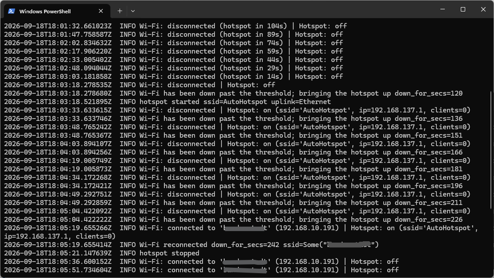

# Autospot

Automatic hotspot creator for Windows.

This program is intended for astrophotographers who use their NINA computer both on their home network and out in the field.

Autospot starts on Windows startup and continuously monitors the connection. If the computer loses its Wi-Fi connection, it waits two minutes for it to reconnect; if the connection isn't restored by then, it creates a hotspot.



## Installation

Download the latest version from the [releases](https://github.com/uaraven/autospot/releases), unzip it, adjust the configuration to your needs, and run the program.

There are two ways to run Autospot: as a Windows service or as a simple application.

### Running as an application

This method is recommended if you use automatic login in Windows. This starts Autospot in your own login session, so it only runs once you've logged in. If you need the hotspot available before login (e.g. when connecting to a machine in the field), install Autospot as a Windows service instead – see below.

To enable automatic start after user login:

- In the File Explorer context menu for autospot.exe, choose "Show more options" -> "Create shortcut".
- Press Windows key+R and run `shell:startup` -- this will open the Startup folder.
- Move the shortcut for autospot.exe into the Startup folder.
- autospot.exe will start the next time you log in to Windows.

Autospot prints status messages to the console window it runs in, and also writes log files to the `Documents\autospot\logs` folder.

### Running as a Windows service

Autospot can run as a Windows service instead of a console app, so it starts before any
user logs in. From an elevated ("Run as administrator") command prompt or PowerShell:

```
autospot.exe service install
```

This installs and starts the service. It will then start automatically with Windows, even when no user logs in.

To check whether the service is running:

```
autospot.exe service status
```

To update Autospot, stop and unregister the service first:

```
autospot.exe service remove
```

Run `autospot.exe service install` again once the new executable is in place.

To make the service pick up configuration changes, restart it instead:

```
autospot.exe service restart
```

The service logs to `%ProgramData%\autospot\logs\`, at the level set by
`logging.service_level` in `autospot.toml` (defaults to `info`, since service mode has
no console for routine status lines to appear in). While the service is running, plain
`autospot.exe` (with no service commands) will print a warning and exit instead of
starting a second watchdog -- stop or remove the service first if you want to run it as
a console app again.

## Configuration

There is an `autospot.toml` configuration file distributed alongside `autospot.exe`. Edit it with Notepad to update the settings as you need. You can change the check interval, the disconnection wait time, the name and password for the hotspot, etc. All the configuration options in `autospot.toml` are commented with explanations.

## Companion device

The companion device is a DIY USB dongle with a microcontroller and a display. It simplifies the astrophotographer's life (already complicated enough without all this IT shit) by showing the NINA computer's current connection status, its IP address for remote desktop connections, and the hotspot's SSID and password when the hotspot is enabled.

See the [companion's readme](companion/readme.md) for details.

## License

Autospot is released into the public domain under the [Unlicense](LICENSE). Do whatever you want with it.
